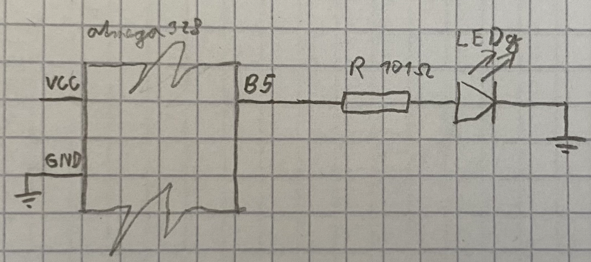

# Lab 1: Dominik Vaško

### Morse code

1. Listing of C code which repeats one "dot" and one "comma" (BTW, in Morse code it is letter `A`) on a LED. Always use syntax highlighting, meaningful comments, and follow C guidelines:

```c
int main(void)
{
    // Set pin where on-board LED is connected as output
    pinMode(LED_GREEN, OUTPUT);
    
#define LED_GREEN PB5   // PB5 is AVR pin where red on-board LED 
                        // is connected
#define SHORT_DELAY 250 // Delay in milliseconds
#define LONG_DELAY 500 // Delay in milliseconds
#ifndef F_CPU
# define F_CPU 16000000 // CPU frequency in Hz required for delay funcs
#endif

/* Includes ----------------------------------------------------------*/
#include <avr/io.h>     // AVR device-specific IO definitions
#include <util/delay.h> // Functions for busy-wait delay loops


// -----
// This part is needed to use Arduino functions but also physical pin
// names. We are using Arduino-style just to simplify the first lab.
#include "Arduino.h"
#define PB5 13          // In Arduino world, PB5 is called "13"

    // Infinite loop
    while (1)
    {
        // Generate a lettre `A` Morse code

        led_value = LOW;
        digitalWrite(LED_GREEN, led_value);
        _delay_ms(SHORT_DELAY);
        led_value = HIGH;
        digitalWrite(LED_GREEN, led_value);
        _delay_ms(SHORT_DELAY);
        led_value = LOW;
        digitalWrite(LED_GREEN, led_value);
        _delay_ms(LONG_DELAY);
        led_value = HIGH;
        digitalWrite(LED_GREEN, led_value);
        _delay_ms(LONG_DELAY);

    }

    // Will never reach this
    return 0;
}
```

2. Scheme of Morse code application, i.e. connection of AVR device, LED, resistor, and supply voltage. The image can be drawn on a computer or by hand. Always name all components and their values!

   
